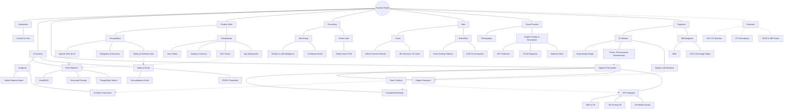

The user is asking me to:

1. Rename "Design leadership" to "Graphic Design & Illustrations"
2. Create a new section called "Bets" for Caval and EventHive
3. Restructure "Products Shipped" into:
   - Product Work: ThoughtSpot, Policybazaar
   - Consulting: Tata (management), Chisel (product)
   - Bets: Caval, EventHive
4. Rephrase "Recognitions" to be more downplayed
5. Move Thesis under IIT Madras branch
6. Critique the graph bluntly - is it telling a story? Does it feel like a mental model of a person?

The user wants me to be blunt and rude, not sugar-coating things. They want me to analyze if the graph communicates:
- "This person cares about [X]"
- "They see the world through [Y] lens"
- "They keep returning to [Z] problem"

Let me critique this honestly:

**What's working:**
- The main paths (AI Systems, Spatial & Perception, Visual Practice) are genuinely interesting and not generic
- There's technical depth visible
- The cross-connections show systems thinking

**What's NOT working:**

1. **It still reads like a resume with better formatting.** The nodes are still "things I did" not "things I care about." There's no THESIS. No central question. No obsession visible.

2. **Where's the "why"?** Why did this person work on foveated rendering? Why AI ethics? Why RAG? The graph shows WHAT but not WHY. A mental model needs motivation visible.

3. **The emotional center is missing.** What does this person actually care about? Reading this graph, I don't know if they care about:
   - Making AI trustworthy?
   - Human perception and how we experience interfaces?
   - Building things that ship vs. researching?
   - The intersection of art and technology?

The graph lacks a compelling narrative thread connecting these disparate interests. It feels like a collection of projects rather than a coherent exploration of a core passion. The visual practice seems particularly disconnected, hanging off the graph without a clear connection to the technical work. There's potential for a more nuanced story about how art, technology, and human perception intersect, but right now it's just a list of accomplishments.

The critique reveals a fundamental problem: the graph doesn't communicate a personal journey or intellectual obsession. It's a showcase of skills, not a window into someone's mind. To truly represent a mental model, it needs to show not just what someone has done, but why they care, what drives them, and how their different experiences connect to a deeper understanding of the world.

A more compelling approach would weave together different domains through central themes like human perception, trust in technology, or the ways creative and technical thinking inform each other. This isn't just about reorganizing information, but about revealing the underlying curiosity and perspective that gives meaning to diverse work.

The proposed structure moves beyond listing achievements to telling a more nuanced story. By reframing sections like "Things I Shipped" or "Advisory Work", the narrative becomes more dynamic and personal. Recognitions aren't just accolades, but markers of meaningful moments and learning.

Distributing awards contextually means each achievement connects directly to its relevant work, creating a more integrated and authentic representation of professional journey.
## Blunt Critique

**The graph is still a resume wearing a costume.**

You've reorganized your LinkedIn into nodes and edges, but it doesn't answer the fundamental question a mental model should answer: *What does this person actually give a shit about?*

Right now, if I explore this graph, I learn:
- You worked at these places ✓
- You built these things ✓
- You went to these schools ✓
- You won some stuff ✓

I do NOT learn:
- Why you keep returning to perception-related problems (gaze, haptics, foveated rendering, photography — there's clearly a thread here, but the graph doesn't name it)
- What you actually believe about AI (you built an ethics framework — what's YOUR position? what hard question are YOU wrestling with?)
- Why you left a PM job to do an MBA and then went back to PM (that's a choice worth explaining)
- What connects the art and the engineering (or are they just... separate hobbies?)

**The "Trajectory" section is the biggest offender.** It's literally "places I existed at" with no narrative. A timeline is not a mental model. What changed in you between IIT and IIM? Why did you leave Policybazaar? What did consulting teach you that PM work didn't?

**Visual Practice feels bolted on.** "I also take photos and made NFTs" — okay? How does that connect to anything else? Does your photography inform how you think about interfaces? Does your design background change how you write PRDs? If yes, show it. If no, why is it even in your professional portfolio?

**The cross-links are weak.** You have a few dotted lines but they feel arbitrary. The REAL connections would be:
- Your entire career orbits around **how humans perceive and interact with systems** — that's the actual thesis, but you haven't named it
- Your AI work is specifically about **AI that doesn't bullshit people** (ethics, groundedness, safety) — that's a stance, but you haven't claimed it

---

## What's Actually Working

The path names (AI Systems, Spatial & Perception) are legitimately good. They're not generic resume headers.

The technical depth is visible — someone can see you actually wrote code, actually did research, actually shipped things. That's credible.

The Bets rename is right. Calling it "Entrepreneurship" would be cringe. "Bets" has honesty in it — you risked something.

---

## Proposed Restructure

```
rudram/
├── information.md
│
├── ai-systems/
│   ├── [keep as is — this is solid]
│
├── spatial-and-perception/
│   ├── [keep as is — this is solid]
│
├── product-work/
│   ├── thoughtspot/
│   │   ├── [actual projects, outcomes, learnings]
│   └── policybazaar/
│       ├── [actual projects, outcomes, learnings]
│
├── consulting/
│   ├── tata-group.md (management consulting)
│   └── chisel-labs.md (product advisory)
│
├── bets/
│   ├── caval.md
│   │   └── [what you risked, what you learned, why it mattered]
│   └── eventhive.md
│       └── [same]
│
├── visual-practice/
│   ├── photography/
│   │   └── [needs depth — by place? by style? what draws you to it?]
│   ├── graphic-design-and-illustrations/
│   │   └── [NFTs, Behance, E-Cell magazine]
│
├── trajectory/
│   ├── iit-madras/
│   │   ├── engineering-design.md
│   │   ├── thesis-photoacoustic.md [NESTED HERE NOW]
│   │   └── research-haptics-lab.md
│   └── iim-bangalore/
│       ├── mba.md
│       └── nccu-exchange.md
│
└── footnotes/
    └── [awards, recognition — framed as timestamps, not trophies]
```

---

## Revised Mermaid



---

## The Hard Question You Need to Answer

Before this becomes a real mental model, you need to articulate:

**What's your thesis?**

Looking at your work, I see a candidate thesis:

> "I care about how humans perceive and trust the systems they use — whether that's VR interfaces that respect how eyes work, AI that doesn't hallucinate, or products that actually serve users instead of metrics."

Is that true? Is that what connects the dots?

If yes, that should be *visible* in the graph structure. Maybe even a node called "What I Care About" or "The Thread" that explicitly names it.

If no, what IS the thread? Because right now the graph says "this person is competent at many things" but not "this person has a point of view."

---

## What Each Node Should Feel Like

You said each node should feel like a tiny piece of writing. Here's what that means:

**Bad node (what you have now):**
> **GraphRAG Implementation**
> Built a GraphRAG system with advanced chunking and retrieval. Deployed working prototype.

**Good node (what it should be):**
> **GraphRAG Implementation**
> Standard RAG felt like searching with a blindfold — you get results, but you don't know why. Graph structures preserve relationships that chunking destroys. I started from scratch twice (see: chunking-experiments, the graveyard). The working version uses [specific technique] because [specific reason]. Still not satisfied with [specific limitation].

The second version tells me how you think, not just what you did.

---

**Your turn.** Answer the thesis question. Then we refine.