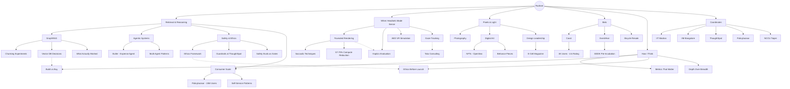
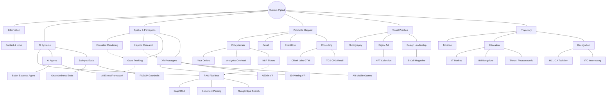

version 1:

```mermaid
graph TB
    %% Root
    R((Rudram))
    
    %% First-level centers of gravity
    R --> RR[Retrieval & Reasoning]
    R --> XR[When Headsets Made Sense]
    R --> PL[Pixels & Light]
    R --> B[Bets]
    R --> HT[How I Think]
    R --> C[Coordinates]
    
    %% Retrieval & Reasoning depth
    RR --> GR[GraphRAG]
    RR --> AG[Agentic Systems]
    RR --> SF[Safety & Ethics]
    RR --> CS[Consumer Scale]
    
    GR --> CH[Chunking Experiments]
    GR --> VD[Vector DB Decisions]
    GR --> WW[What Actually Worked]
    
    AG --> BU[Butler - Expense Agent]
    AG --> MP[Multi-Agent Patterns]
    
    SF --> EF[Ethics Framework]
    SF --> GU[Guardrails at ThoughtSpot]
    SF --> SE[Safety Evals as Gates]
    
    CS --> PB[Policybazaar - 15M Users]
    CS --> SS[Self-Service Patterns]
    
    %% XR depth
    XR --> FR[Foveated Rendering]
    XR --> HP[Haptics Evaluation]
    XR --> AED[AED VR Simulation]
    XR --> GT[Gaze Tracking]
    
    FR --> SC[Saccadic Techniques]
    FR --> CM[57-70% Compute Reduction]
    
    %% Pixels & Light depth
    PL --> PH[Photography]
    PL --> DA[Digital Art]
    PL --> DL[Design Leadership]
    
    DA --> NFT[NFTs - OpenSea]
    DA --> BH[Behance Pieces]
    
    DL --> EC[E-Cell Magazine]
    
    %% Bets depth
    B --> CV[Caval]
    B --> EH[EventHive]
    B --> BR[Bicycle Resale]
    
    CV --> CVD[4K Users - 4.6 Rating]
    EH --> EHD[3000K Pre-Incubation]
    
    %% How I Think depth
    HT --> BB[Build vs Buy]
    HT --> MM[Metrics That Matter]
    HT --> EB[Ethics Before Launch]
    HT --> DO[Depth Over Breadth]
    
    %% Coordinates
    C --> IIT[IIT Madras]
    C --> IIM[IIM Bangalore]
    C --> TS[ThoughtSpot]
    C --> PBZ[Policybazaar]
    C --> TW[NCCU Taipei]
    
    %% Cross-connections - the interesting edges
    GT -.-> TC[Tata Consulting]
    TC -.-> CS
    EF -.-> EB
    VD -.-> BB
    FR -.-> HP
```

version 2:

```mermaid
flowchart TB
    RP((Rudram Piplad))
    
    RP --- INFO[Information]
    RP --- AI[AI Systems]
    RP --- SPATIAL[Spatial & Perception]
    RP --- PRODUCTS[Products Shipped]
    RP --- VISUAL[Visual Practice]
    RP --- TRAJECTORY[Trajectory]
    
    %% Information
    INFO --- CONTACT[Contact & Links]
    
    %% AI Systems
    AI --- RAG[RAG Pipelines]
    AI --- AGENTS[AI Agents]
    AI --- SAFETY[Safety & Evals]
    
    RAG --- GRAPHRAG[GraphRAG]
    RAG --- DOCPARSE[Document Parsing]
    RAG --- TSSEARCH[ThoughtSpot Search]
    
    AGENTS --- BUTLER[Butler Expense Agent]
    AGENTS --- ETHICS[AI Ethics Framework]
    
    SAFETY --- GROUND[Groundedness Evals]
    SAFETY --- PII[PII/DLP Guardrails]
    
    %% Spatial
    SPATIAL --- FOVEAT[Foveated Rendering]
    SPATIAL --- HAPTICS[Haptics Research]
    SPATIAL --- GAZE[Gaze Tracking]
    SPATIAL --- XRPROTO[XR Prototypes]
    
    XRPROTO --- AED[AED in VR]
    XRPROTO --- PRINT3D[3D Printing VR]
    XRPROTO --- ARMOBILE[AR Mobile Games]
    
    %% Products
    PRODUCTS --- PB[Policybazaar]
    PRODUCTS --- CAVAL[Caval]
    PRODUCTS --- EVENTHIVE[EventHive]
    PRODUCTS --- CONSULT[Consulting]
    
    PB --- ORDERS[Your Orders]
    PB --- ANALYTICS[Analytics Overhaul]
    PB --- NLPTICKET[NLP Tickets]
    
    CONSULT --- CHISEL[Chisel Labs GTM]
    CONSULT --- TCS[TCS CPG Retail]
    
    %% Visual
    VISUAL --- PHOTO[Photography]
    VISUAL --- DIGART[Digital Art]
    VISUAL --- DESIGNLEAD[Design Leadership]
    
    DIGART --- NFT[NFT Collection]
    DESIGNLEAD --- ECELL[E-Cell Magazine]
    
    %% Trajectory
    TRAJECTORY --- TIMELINE[Timeline]
    TRAJECTORY --- EDU[Education]
    TRAJECTORY --- RECOG[Recognition]
    
    EDU --- IITM[IIT Madras]
    EDU --- IIMB[IIM Bangalore]
    EDU --- THESIS[Thesis: Photoacoustic]
    
    RECOG --- TECHJAM[HCL-CA TechJam]
    RECOG --- INTERROBANG[ITC Interrobang]
    
    %% Cross-links
    GAZE -.-> ETHICS
    NLPTICKET -.-> RAG
    FOVEAT -.-> GAZE
    HAPTICS -.-> XRPROTO
```