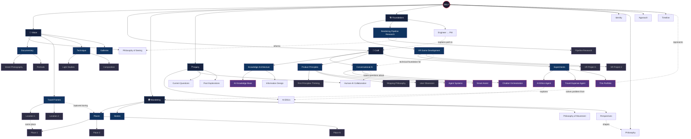

The user wants me to help design a knowledge graph-style portfolio based on their resume and information available. Let me recall what I know about this user from their resume and previous conversations:

From the resume context:
- Product Manager with AI experience
- Work experience includes:
  - Sprinklr (AI products, chatbots, knowledge bases)
  - Previous work in product management
- Education likely includes undergrad where they did VR game development and rendering pipeline research
- Photography is important to them
- Travel is important
- Side projects: AI Ethics Agent, Travel Expense Agent, the portfolio itself
- They want this to be a mental model, not a traditional portfolio

Let me think about how to structure this as a knowledge graph that represents who this person is, with depth and interconnected concepts.

Key principles the user wants:
1. Not shallow - depth at every level
2. Progressive detail - each click reveals more
3. Centers of gravity, lenses, and artifacts
4. No generic headings like "Work Experience" or "Side Projects"
5. Photography prominent
6. VR game dev and rendering pipeline from undergrad
7. Travel as distinct node
8. "About Me" as central node
9. Interconnected concepts, not folders

Let me think about this from first principles. What makes a person? What are the "centers of gravity" for this individual?

Centers of Gravity (main lenses through which to understand this person):
1. Identity/Core (the central node - who they are)
2. How they think (philosophy, approach)
3. What they build (products, artifacts)
4. How they see the world (photography, travel)
5. What they've explored (research, curiosity areas)
6. Where they've been (journey, experiences)

Let me think about meaningful categories that aren't just "Work" and "Projects":

**Lenses (ways to explore):**
- Builder (things they've created)
- Thinker (how they approach problems)
- Explorer (travel, curiosity)


- Visual Storyteller (photography)
- Researcher (deep dives, technical explorations)

I'll reframe work experience and structure to create a rich, interconnected narrative. The goal is to move beyond traditional portfolio constraints, creating a dynamic representation of professional identity. Each domain becomes a lens for understanding the individual's journey, with multiple entry points and deep, meaningful connections between different aspects of their experience.

The portfolio will emphasize progressive disclosure, allowing viewers to dive deeper into each node and explore the intricate relationships between different life experiences, professional achievements, and personal passions.

The proposed structure creates a multidimensional map of personal and professional growth, organized around seven core lenses:

1. Mind: Philosophical approach and problem-solving
2. Craft: Product creation and management
3. Visual World: Aesthetic and photographic perspectives
4. Technical Foundations: Engineering and emerging technologies
5. Journeys: Experiential learning through travel
6. Research & Curiosity: Intellectual explorations
7. Current Experiments: Active innovation spaces

Each lens contains nested domains and artifacts, transforming a traditional resume into a rich, interconnected narrative of professional identity.

Key domains like Product Management and Photography reveal intricate sub-domains: conversational AI systems, documentary photography techniques, and specific research interests. The structure allows for nuanced representation of skills, experiences, and creative pursuits across multiple interconnected domains.

The framework emphasizes not just achievements, but the underlying principles and philosophical approaches driving personal and professional development.

Cross-domain connections emerge naturally - travel influences photography, technical research informs product management, and ethical considerations shape AI work. These intersections create a rich, multidimensional perspective on personal growth and expertise.

The proposed file structure reveals a systematic approach to documenting personal journey, professional craft, and core philosophical foundations. Each directory represents a different facet of professional and personal development, allowing for nuanced exploration of interconnected domains.

The core directory captures fundamental identity and philosophical frameworks, while the craft section breaks down specific professional competencies and insights across different domains like conversational AI, knowledge systems, and product principles.

Visual exploration and technical foundations emerge as complementary narrative threads, with photography representing creative expression and technical research highlighting systematic problem-solving approaches. The structure suggests an integrated perspective bridging artistic and engineering disciplines.

Key gravitational centers appear to be:
- Personal storytelling through visual mediums
- Technical innovation and research exploration
- Philosophical reflections on travel and human experience
- Experimental intersections of technology and ethics

The portfolio seems designed to showcase interconnected intellectual and creative pursuits, revealing a holistic approach to understanding complex systems through multiple lenses.

Each center represents a different mode of engagement: visual documentation, technical problem-solving, philosophical inquiry, and experimental thinking. These aren't just categories, but dynamic spaces of personal investigation and meaning-making.

Photography connects deeply with travel, revealing perspectives through visual storytelling. Technical research in VR and rendering intersects with visual perception, showing how technological understanding shapes creative expression. AI work carries ethical considerations, reflecting a nuanced approach to technological development.

The connections reveal a complex personal ecosystem: engineering foundations informing product design, travel inspiring technological solutions, ethical considerations guiding conversational AI development. Each domain isn't isolated, but interconnected through personal curiosity and systemic thinking.

Key relationships emerge through bidirectional links - travel generating photographic narratives, rendering research expanding visual understanding, ethical frameworks shaping technological interventions. These connections demonstrate an integrated approach to understanding complex systems and human experience. I'll complete the partial thought from the previous rewritten thinking by incorporating the new information about technical foundations and origins:

6. **Origins** (Technical Foundations)
   - VR Game Development explores immersive technology foundations
   - Rendering pipeline research demonstrates deep technical understanding
   - Career trajectory from engineer to product management shows adaptive skills

The new section reveals a rich technical background spanning game development, rendering technologies, and a strategic career evolution. It connects technical expertise with broader product thinking, highlighting a multifaceted approach to technology and design. I'll continue the Mermaid diagram structure, focusing on the cross-connections and hierarchy. The diagram seems to be mapping out personal domains and interconnections, with "Me" as the central node branching into different spheres of exploration and development. The goal appears to be creating a comprehensive visual representation of personal knowledge, projects, and interests across multiple interconnected domains.

The diagram will likely expand on the core centers of gravity, showing how different areas of interest and expertise relate to each other, with potential cross-pollination between domains like making, exploring, and questioning. The nested structure suggests a thoughtful approach to organizing personal and professional insights, with each domain containing specific sub-categories and potential for deep exploration.

The Mermaid graph uses a top-down (TB) layout to clearly illustrate the hierarchical relationships, with the central node branching out into primary domains, and then further subdividing into more specific areas of focus. This approach allows for a nuanced visualization of personal growth, interests, and interconnected knowledge systems.

Key areas like Questioning expand into Human-AI Interaction and Current Curiosities, revealing an intellectual curiosity about emerging technological interfaces. The Origins section traces developmental pathways through VR development, rendering research, and professional transitions, highlighting a trajectory of technical exploration and skill evolution.

Intriguing cross-connections demonstrate how different domains inform and interact with each other - for instance, rendering research influencing photographic philosophy, or travel frames being captured during explorations of various places.

The emerging diagram suggests a complex, interconnected understanding of personal and technological development, with nodes representing different aspects of professional and intellectual growth.

I'm exploring more nuanced, evocative language to describe core conceptual relationships, focusing on personal agency and exploratory dimensions of knowledge creation.

The proposed labels emphasize introspective and dynamic perspectives, transforming abstract technical concepts into more human-centered descriptors that capture the essence of intellectual and technological exploration.
# Portfolio as a Knowledge Graph: A Mental Model of You

Alright, let me think through this carefully. You're right that a human isn't a folder structure — and honestly, most portfolios fail because they're organized for the *creator's convenience*, not for the *reader's understanding*. 

What you want is more like a **navigable mental model** — something that lets someone understand *how you think*, not just *what you've done*. That's fundamentally different.

Let me work through this from first principles.

---

## Part 1: The Core Problem with Traditional Portfolios

Traditional portfolios are **taxonomies**. They ask: "What buckets does your work fit into?"

But you're asking for something different: **an ontology**. You're asking: "What are the relationships between the things that make you *you*?"

The difference:
- **Taxonomy**: "Work → Company A → Project 1, Project 2"
- **Ontology**: "Agent Systems → *enabled by* Technical Foundations → *informed by* Philosophy of Human-AI Interaction → *expressed through* AI Ethics Side Project"

A good knowledge graph reveals the *shape of your thinking*, not just your outputs.

---

## Part 2: Identifying Your Centers of Gravity

Based on what you've shared, you have **six gravitational centers** — each is a lens through which someone could understand you:

| Center | What It Represents | Why It Matters |
|--------|-------------------|----------------|
| **Self** | Identity, values, philosophy | The hub everything connects to |
| **Vision** | Photography, visual thinking | How you *see* and capture the world |
| **Craft** | Products you've built, PM work | What you *make* and how |
| **Wandering** | Travel, exploration | How you move through the world |
| **Inquiry** | Research, AI ethics, curiosity | What questions drive you |
| **Foundations** | VR, rendering, technical depth | Where you came from, what shapes you |

These aren't folders — they're **entry points**. Someone interested in your photography enters through "Vision." Someone evaluating you as a PM enters through "Craft." Both paths eventually reveal the whole picture.

---

## Part 3: The Key Elements

### Tier 1: Centers of Gravity (6 main nodes)

```
┌─────────────────────────────────────────────────────────────────┐
│                        CENTERS OF GRAVITY                        │
├─────────────────────────────────────────────────────────────────┤
│                                                                  │
│  ┌──────────┐                                                   │
│  │   SELF   │ ◄── Central node. Who you are, values, approach   │
│  └──────────┘                                                   │
│        │                                                         │
│        ├────────── Vision (Photography, Aesthetics)              │
│        ├────────── Craft (Products, Building)                   │
│        ├────────── Wandering (Travel, Exploration)              │
│        ├────────── Inquiry (Research, Ethics, Questions)        │
│        └────────── Foundations (VR, Rendering, Origins)         │
│                                                                  │
└─────────────────────────────────────────────────────────────────┘
```

### Tier 2: Domains within each Center

Each center contains **domains** — thematic clusters that have their own coherence:

**Self**
- Identity (who you are beyond work)
- Philosophy (how you think about problems)
- Timeline (your journey, not a resume — a narrative)
- Approach (principles, working style)

**Vision** (Photography prominent)
- Philosophy of Seeing (why you shoot, what draws your eye)
- Documentary Work (street, portraits, candid)
- Travel Frames (photos from travels — *links to Wandering*)
- Light Studies (technique exploration)
- Galleries (curated collections)

**Craft** (Work experience reframed by *domain*, not employer)
- Conversational AI (the problem space you've lived in)
  - Agent Systems (artifact: Sprinklr's handoff work)
  - Smart Assist (artifact: co-pilot features)
  - Chatbot Orchestration (artifact)
- Knowledge Architecture (another domain you understand deeply)
  - AI Knowledge Base (artifact)
  - Information Design (approach/philosophy)
- Product Principles (how you think about building)
  - First Principles Thinking
  - Shipping Philosophy
  - User Obsession (specifics, not platitudes)
- Experiments (active side projects)
  - AI Ethics Agent
  - Travel Expense Agent
  - This Portfolio (meta!)

**Wandering** (Travel as distinct node)
- Places (nodes for meaningful locations)
- Stories (narrative pieces, not just photo dumps)
- Philosophy of Movement (why you travel, what it gives you)
- Perspectives (what travel has taught you — links to *Self*)

**Inquiry** (Research, curiosity, questions)
- AI Ethics (philosophical grounding → links to AI Ethics Agent)
- Human-AI Collaboration (what you think about)
- Current Questions (what you're actively curious about)
- Past Explorations (closed loops of inquiry)

**Foundations** (Technical origins)
- VR Game Development (undergrad work)
  - Project 1, Project 2, etc.
  - What you learned
- Rendering Pipeline Research (undergrad)
  - Papers, experiments
  - How this shapes your visual thinking → *links to Vision*
- Engineer → PM (the transition story — *this is a narrative node*)

### Tier 3: Artifacts & Deep Nodes

Every domain should have **artifacts** — the concrete evidence of your work:

- A project page
- A photo gallery
- A reflection piece
- A case study
- A code repository
- A published piece

And **connections to other nodes** — because no artifact exists in isolation.

---

## Part 4: The File Structure

Here's how this maps to a navigable file structure (Obsidian-compatible):

```
/portfolio-root
│
├── /self
│   ├── _index.md                    # Hub page for "Self"
│   ├── identity.md                  # Who I am
│   ├── philosophy.md                # How I think
│   ├── approach.md                  # How I work
│   └── timeline.md                  # Journey narrative
│
├── /vision
│   ├── _index.md                    # Hub page
│   ├── philosophy-of-seeing.md      # Why I photograph
│   │
│   ├── /documentary
│   │   ├── _index.md
│   │   ├── street.md
│   │   └── portraits.md
│   │
│   ├── /travel-frames
│   │   ├── _index.md
│   │   └── [location].md            # Linked to /wandering/places
│   │
│   ├── /technique
│   │   ├── light-studies.md
│   │   └── composition.md
│   │
│   └── /galleries
│       └── [collection-name].md     # Curated sets
│
├── /craft
│   ├── _index.md                    # Hub page
│   │
│   ├── /conversational-ai
│   │   ├── _index.md                # Domain overview
│   │   ├── agent-systems.md         # Artifact
│   │   ├── smart-assist.md          # Artifact
│   │   └── chatbot-orchestration.md # Artifact
│   │
│   ├── /knowledge-architecture
│   │   ├── _index.md
│   │   ├── ai-knowledge-base.md     # Artifact
│   │   └── information-design.md    # Approach
│   │
│   ├── /product-principles
│   │   ├── first-principles.md
│   │   ├── shipping-philosophy.md
│   │   └── user-obsession.md
│   │
│   └── /experiments
│       ├── ai-ethics-agent.md       # Links to /inquiry/ai-ethics
│       ├── travel-expense-agent.md  # Links to /wandering
│       └── this-portfolio.md        # Meta-artifact
│
├── /wandering
│   ├── _index.md
│   ├── philosophy-of-movement.md
│   │
│   ├── /places
│   │   └── [location].md            # Individual location nodes
│   │
│   ├── /stories
│   │   └── [story-name].md          # Narrative pieces
│   │
│   └── perspectives.md              # What travel teaches me
│
├── /inquiry
│   ├── _index.md
│   ├── ai-ethics.md                 # Deep dive
│   ├── human-ai-collaboration.md
│   ├── current-questions.md
│   └── past-explorations.md
│
├── /foundations
│   ├── _index.md
│   │
│   ├── /vr-development
│   │   ├── _index.md
│   │   └── [project].md
│   │
│   ├── /rendering-research
│   │   ├── _index.md
│   │   └── pipeline-work.md
│   │
│   └── engineer-to-pm.md            # Transition narrative
│
└── _graph-index.md                  # Meta-layer: how nodes connect
```

---

## Part 5: The Knowledge Graph (Mermaid Visualization)

Here's the full graph with hierarchy AND cross-connections:



---

## Part 6: The Relationships That Matter

Here's the **edge semantics** — what the connections actually mean:

| Connection | Type | Meaning |
|------------|------|---------|
| Travel Frames → Places | *captured during* | Photos taken at travel destinations |
| AI Ethics Agent → AI Ethics | *explores* | Side project investigates this area of inquiry |
| Conversational AI → Human-AI | *raises questions about* | Work experience informed research interests |
| Travel Expense Agent → Wandering | *solves problem from* | Built tool to address personal pain point |
| Rendering Research → Philosophy of Seeing | *informs* | Technical background shapes visual thinking |
| VR Development → Craft | *foundation for* | Engineering past enables PM present |
| Perspectives → Philosophy | *shapes* | Travel experiences inform worldview |
| This Portfolio → Self | *represents* | Meta-artifact that embodies the whole |
| Engineer → PM → Craft | *explains path to* | The transition narrative contextualizes work |

---

## Part 7: Design Principles for Implementation

If you're building this in Obsidian or as a web app:

**1. Every node should have:**
- A brief description (1-2 sentences)
- Outgoing links (what does this connect to?)
- Incoming links (what connects here?)
- Depth indicator (is there more to explore?)

**2. Progressive disclosure:**
```
Level 0: Just "Self" visible
Level 1: Six centers of gravity appear
Level 2: Domains within the selected center
Level 3: Artifacts and deep nodes
Level 4: Full detail — case studies, galleries, narratives
```

**3. Multiple entry points:**
Someone searching for "photography" should land on Vision.
Someone searching for "Sprinklr" should land on the relevant artifact in Craft → Conversational AI.
Both paths should let them traverse to the full graph.

**4. The "This Portfolio" node:**
This is your most interesting meta-artifact. It should:
- Explain the design philosophy (what you've laid out here)
- Link to every major center
- Serve as a "how to read me" guide

---

## Closing Thought

What you're building isn't just a portfolio — it's a **second brain export**. You're saying: *"Here's how I organize my understanding of myself. Navigate it however makes sense to you."*

That's a fundamentally more honest and interesting artifact than "Work Experience | Projects | About."

The graph doesn't just show what you've done. It shows **how you think**. And for a PM, that's the thing that actually matters.

---

Want me to go deeper on any specific section? I can sketch out what individual nodes should contain, or help draft the content for key hub pages like `/craft/_index.md` or `/vision/philosophy-of-seeing.md`.