## The Thesis

> "I care about how humans perceive and trust the systems they use — whether that's VR interfaces that respect how eyes work, AI that doesn't hallucinate, or products that actually serve users instead of metrics."
> 

This thread connects everything. It's not stated explicitly in the graph, but it should be *felt* as you navigate.

---

## Graph Structure

```mermaid
flowchart TB
    RP((Rudram Piplad))
    
    RP --- INFO[Information]
    RP --- AI[AI Systems]
    RP --- SPATIAL[Spatial & Perception]
    RP --- PRODWORK[Product Work]
    RP --- CONSULT[Consulting]
    RP --- BETS[Bets]
    RP --- VISUAL[Visual Practice]
    RP --- TRAJECTORY[Trajectory]
    RP -.- FOOTNOTES[Footnotes]
    
    %% Information
    INFO --- CONTACT[Contact & Links]
    
    %% AI Systems
    AI --- RAG[RAG Pipelines]
    AI --- AGENTS[AI Agents]
    AI --- SAFETY[Safety & Evals]
    
    RAG --- GRAPHRAG[GraphRAG]
    RAG --- DOCPARSE[Document Parsing]
    RAG --- CHUNKING[Chunking Strategies]
    
    AGENTS --- BUTLER[Butler Expense Agent]
    AGENTS --- ETHICS[AI Ethics Framework]
    
    SAFETY --- EVALFRAMEWORK[Eval Framework]
    SAFETY --- PII[PII/DLP Guardrails]
    
    %% Spatial & Perception
    SPATIAL --- FOVEAT[Foveated Rendering & Gaze Tracking]
    SPATIAL --- HAPTICS[Haptics Research]
    SPATIAL --- XRPROTO[XR Prototypes]
    
    XRPROTO --- AED[AED in VR]
    XRPROTO --- PRINT3D[3D Printing VR]
    XRPROTO --- ARMOBILE[AR Mobile Games]
    
    %% Product Work
    PRODWORK --- TS[ThoughtSpot]
    PRODWORK --- PB[Policybazaar]
    
    TS --- TSBOUNDARY[Boundaryless / Enterprise Search]
    TS --- TSNAV[Navigation & Discovery]
    TS --- TSOBJSEARCH[Object Search]
    TS --- TSHOME[Homepage]
    
    PB --- ORDERS[Your Orders]
    PB --- WEBANALYTICS[Web Analytics]
    PB --- GROWTHMOBILE[Growth & Mobile App]
    
    %% Consulting
    CONSULT --- TATA[Tata Group]
    CONSULT --- CHISEL[Chisel Labs]
    
    TATA --- MLOPS[MLOps & LLM Intelligence]
    TATA --- AIMATURITY[AI Maturity Model]
    
    CHISEL --- GTM[Global SaaS GTM]
    
    %% Bets
    BETS --- CAVAL[Caval]
    BETS --- EVENTHIVE[EventHive]
    
    %% Visual Practice
    VISUAL --- PHOTO[Photography]
    VISUAL --- GRAPHICDESIGN[Graphic Design & Illustrations]
    
    GRAPHICDESIGN --- NFT[NFT Collection]
    GRAPHICDESIGN --- ECELL[E-Cell Magazine]
    GRAPHICDESIGN --- BEHANCE[Behance Work]
    
    %% Trajectory
    TRAJECTORY --- IITM[IIT Madras]
    TRAJECTORY --- IIMB[IIM Bangalore]
    
    IITM --- ENGDES[Engineering Design]
    IITM --- THESIS[Thesis: Photoacoustic Spectroscopy]
    
    IIMB --- MBA[MBA]
    IIMB --- NCCU[NCCU Exchange Taipei]
    
    %% Footnotes
    FOOTNOTES -.- TECHJAM[HCL-CA TechJam]
    FOOTNOTES -.- INTERROBANG[ITC Interrobang]
    FOOTNOTES -.- GATEJEE[GATE & JEE Ranks]
    
    %% Cross-links
    ETHICS -.-> EVALFRAMEWORK
    EVALFRAMEWORK -.-> TSBOUNDARY
    FOVEAT -.-> XRPROTO
    HAPTICS -.-> XRPROTO
```


---

## File Structure

```
rudram/
├── information.md
│
├── ai-systems/
│   ├── _index.md
│   ├── rag-pipelines/
│   │   ├── _index.md
│   │   ├── graph-rag.md
│   │   ├── document-parsing.md
│   │   └── chunking-strategies.md
│   ├── ai-agents/
│   │   ├── _index.md
│   │   ├── butler-expense-agent.md
│   │   └── ai-ethics-framework.md
│   └── safety-and-evals/
│       ├── _index.md
│       ├── eval-framework.md
│       └── pii-dlp-guardrails.md
│
├── spatial-and-perception/
│   ├── _index.md
│   ├── foveated-rendering-gaze-tracking.md
│   ├── haptics-research.md
│   └── xr-prototypes/
│       ├── _index.md
│       ├── aed-in-vr.md
│       ├── 3d-printing-vr.md
│       └── ar-mobile-games.md
│
├── product-work/
│   ├── _index.md
│   ├── thoughtspot/
│   │   ├── _index.md
│   │   ├── boundaryless-enterprise-search.md
│   │   ├── navigation-and-discovery.md
│   │   ├── object-search.md
│   │   └── homepage.md
│   └── policybazaar/
│       ├── _index.md
│       ├── your-orders.md
│       ├── web-analytics.md
│       └── growth-and-mobile-app.md
│
├── consulting/
│   ├── _index.md
│   ├── tata-group/
│   │   ├── _index.md
│   │   ├── mlops-llm-intelligence.md
│   │   └── ai-maturity-model.md
│   └── chisel-labs/
│       ├── _index.md
│       └── global-saas-gtm.md
│
├── bets/
│   ├── _index.md
│   ├── caval.md
│   └── eventhive.md
│
├── visual-practice/
│   ├── _index.md
│   ├── photography/
│   │   └── _index.md
│   └── graphic-design-and-illustrations/
│       ├── _index.md
│       ├── nft-collection.md
│       ├── ecell-magazine.md
│       └── behance-work.md
│
├── trajectory/
│   ├── _index.md
│   ├── iit-madras/
│   │   ├── _index.md
│   │   ├── engineering-design.md
│   │   └── thesis-photoacoustic-spectroscopy.md
│   └── iim-bangalore/
│       ├── _index.md
│       ├── mba.md
│       └── nccu-exchange-taipei.md
│
└── footnotes/
    ├── _index.md
    ├── hcl-ca-techjam.md
    ├── itc-interrobang.md
    └── gate-jee-ranks.md
```

---

## Node Content Guide

### Root: Rudram Piplad

>I build products that involve AI, and I think a lot about why most AI products feel broken.
>The short answer: they violate trust. They hallucinate confidently. They retrieve irrelevant context. They optimize for metrics that don't align with user value. The systems work, technically. They just don't feel trustworthy.
>This problem isn't new to me. Before AI, I worked on VR systems — specifically, how to render graphics in a way that respects human perception. Your eyes don't see uniformly; why should rendering be uniform? Before that, I worked on haptics — how touch feedback needs to be fast, not strong, to feel real.
>The thread: systems that respect how humans actually experience them.
>Right now, I'm a PM at ThoughtSpot, building AI-powered enterprise search. Before that, I led product at Policybazaar for 15M monthly users. I've also started two companies (one made money, one taught me more), done some consulting, and maintained a visual practice in photography and digital art.
>I studied engineering design at IIT Madras and got an MBA at IIM Bangalore. The combination matters: I can go deep on technical problems and still connect them to business outcomes.
>This portfolio is a graph. It's meant to be explored, not read linearly. Start anywhere. Everything connects eventually.

---

### Information

**File:** `information.md`

**Content:**

```
Email: rudram@alumni.iitm.ac.in
Phone: +91 9940334981
LinkedIn: [link]
GitHub: github.com/rudramroseate8
Behance: [link]
Photography: [link]
```

Just the facts. No bio here — the graph IS the bio.

---

### AI Systems

**File:** `ai-systems/_index.md`

**What this section is about:**
Building AI that doesn't bullshit people. Systems that know what they know, admit what they don't, and fail gracefully when they're wrong.

**Thesis connection:** Trust in systems.

**Content approach:**

> I've spent the last two years building AI systems that need to work in production — not demos, not prototypes, actual products where wrong answers cost money or trust. The thing I keep returning to: most AI failures aren't capability failures, they're trust failures. The model could answer correctly, but it didn't know when to abstain. Or it hallucinated with confidence. Or it retrieved the right document but extracted the wrong fact.
> 
> 
> This section is about that problem — RAG systems that actually retrieve relevant context, agents that know their boundaries, and evaluation frameworks that catch regressions before users do.
> 

---

### RAG Pipelines

**File:** `ai-systems/rag-pipelines/_index.md`

**Content approach:**

> RAG is deceptively simple in theory: retrieve relevant chunks, feed them to an LLM, get better answers. In practice, every decision compounds. How you chunk determines what gets retrieved. How you retrieve determines what the model sees. How the model sees context determines whether the answer is grounded or fabricated.
> 
> 
> I've built RAG systems at ThoughtSpot (enterprise scale, real SLAs) and in side projects (where I could break things freely). The lesson: naive RAG is easy to build and hard to trust. Good RAG requires obsessing over the retrieval layer.
> 

**Sub-nodes:**

**GraphRAG** (`graph-rag.md`)

> Standard RAG felt like searching with a blindfold — you get results, but you don't know why they're connected. Graph structures preserve relationships that chunking destroys.
> 
> 
> I started from scratch twice. The first attempt (chunking-experiments repo) was a graveyard of half-working ideas. The second attempt (graph-rag-trials) actually deployed. Key insight: the graph isn't just for retrieval — it's for explaining why an answer exists.
> 
> **Links:** [GitHub repo], connects to → [[Eval Framework]]
> 

**Document Parsing** (`document-parsing.md`)

> Before you can chunk, you need to parse. PDFs lie about their structure. PPTs hide information in speaker notes. Excel files have merged cells that break everything.
> 
> 
> Built a parser pipeline using Docling that handles PDF, PPT, XLSX. The goal wasn't perfect parsing — it was predictable failure modes. When parsing fails, fail loudly and early.
> 
> **Links:** [GitHub: document-parser-for-rag], [GitHub: doc-parsers]
> 

**Chunking Strategies** (`chunking-strategies.md`)

> The dirty secret of RAG: your chunking strategy matters more than your embedding model. Chunk too small and you lose context. Chunk too large and you dilute relevance. Chunk by page and you split sentences. Chunk by semantic boundaries and you need a model to find them.
> 
> 
> I tried recursive splitting, semantic chunking, parent-child hierarchies. What worked: hybrid approaches that preserve document structure while respecting semantic coherence. What didn't: anything that treated documents as flat text.
> 
> **Links:** [GitHub: chunking-strategy-experiments]
> 

---

### AI Agents

**File:** `ai-systems/ai-agents/_index.md`

**Content approach:**

> Agents are having a moment. Most of what I see is demos — impressive loops that work on happy paths and fail silently on edge cases. The hard part isn't making an agent that works; it's making an agent that knows when it's stuck.
> 
> 
> I've built two agent systems: one for a practical problem (expense tracking), one for a philosophical one (AI ethics evaluation). Both taught me the same lesson: agents need escape hatches and introspection.
> 

**Sub-nodes:**

**Butler Expense Agent** (`butler-expense-agent.md`)

> Travel expense tracking is annoying because it's contextual. A $50 meal might be business or personal depending on who you were with. A cab ride might be reimbursable or not depending on company policy you don't remember.
> 
> 
> Built a multi-agent system that handles categorization, policy checking, and anomaly detection. The interesting part wasn't the agents — it was designing the handoff protocols. When does the categorization agent admit uncertainty and escalate? How does the policy agent handle ambiguous rules?
> 
> **Links:** [GitHub: butler-travel-expense-agent], [GitHub: expense-agents-ui-lovable]
> 

**AI Ethics Framework** (`ai-ethics-framework.md`)

> Most AI ethics frameworks are checklists. Check boxes, ship product, feel good. That's not ethics — that's compliance theater.
> 
> 
> Built a multi-agent evaluation system that asks the hard questions about AI products before users do. The agents are adversarial by design — they look for failure modes, edge cases, fairness violations, manipulation vectors. Philosophy-grounded, practically useful.
> 
> The uncomfortable part: running this on my own projects and finding problems I didn't want to see.
> 
> **Links:** [GitHub: applied-ai-ethics], connects to → [[Eval Framework]]
> 

---

### Safety & Evals

**File:** `ai-systems/safety-and-evals/_index.md`

**Content approach:**

> Shipping AI without evals is shipping blind. You might get lucky. You probably won't. The question isn't whether your model makes mistakes — it will. The question is whether you catch them before users do.
> 
> 
> This section is about building evaluation into the release process, not as an afterthought but as a gate.
> 

**Sub-nodes:**

**Eval Framework** (`eval-framework.md`)

> At ThoughtSpot, I introduced groundedness and safety evals as release gates. The rule: if evals regress, the release doesn't ship. No exceptions, no "we'll fix it next sprint."
> 
> 
> This was politically harder than technically hard. Engineers don't like gates. PMs don't like delays. But the alternative — shipping regressions and fixing them in production — is worse for everyone.
> 
> Metrics that mattered: nDCG@5 for retrieval quality, recall@10 for coverage, latency p95 under 5s. Metrics that didn't matter: anything that couldn't be tied to user trust.
> 
> **Links:** connects to → [[AI Ethics Framework]], connects to → [[Boundaryless / Enterprise Search]]
> 

**PII/DLP Guardrails** (`pii-dlp-guardrails.md`)

> Enterprise AI has a specific failure mode: leaking data that shouldn't be leaked. User asks a question, RAG retrieves a document they shouldn't see, answer includes confidential information.
> 
> 
> Built PII redaction and DLP (data loss prevention) guardrails at ThoughtSpot. Shipped moderation layers. Cleared SOC 2 Type II with zero major findings.
> 
> The lesson: guardrails need to be invisible when working and loud when triggered. Users shouldn't feel surveilled, but violations need to be caught and logged.
> 

---

### Spatial & Perception

**File:** `spatial-and-perception/_index.md`

**What this section is about:**
How humans experience interfaces. VR, AR, gaze tracking, haptics — all different lenses on the same question: how do we build systems that respect how humans actually perceive?

**Thesis connection:** How humans perceive systems.

**Content approach:**

> Before I cared about AI trust, I cared about perceptual honesty. VR systems that make you sick are lying to your vestibular system. Haptic feedback that's delayed breaks the illusion of touch. Interfaces that ignore where your eyes are looking waste compute on pixels you'll never see.
> 
> 
> This was my research focus at IIT Madras. It shapes how I think about all interfaces — digital or physical.
> 

---

### Foveated Rendering & Gaze Tracking

**File:** `spatial-and-perception/foveated-rendering-gaze-tracking.md`

**Content:**

> Human eyes have high resolution only at the fovea — the tiny central region of your vision. Peripheral vision is blurry by design. Traditional rendering ignores this, computing every pixel at full resolution. Wasteful.
> 
> 
> Built a saccadic foveated rendering pipeline for VR using the HTC Vive Pro Eye's eye tracker. The idea: track where the user is looking, render that region at full resolution, degrade the periphery. Results: 57-70% compute reduction with no perceptible quality loss.
> 
> The hard part wasn't the rendering — it was predicting where eyes would move next. Saccades are fast. If you render based on where eyes *were*, you're already late.
> 
> **Links:** [GitHub: foveated-rendering-virtual-reality], connects to → [[XR Prototypes]], connects to → [[Haptics Research]]
> 

---

### Haptics Research

**File:** `spatial-and-perception/haptics-research.md`

**Content:**

> Touch is the forgotten sense in computing. We've optimized visual fidelity for decades. Audio is good enough. But haptics? Still feels like vibration motors from 2010.
> 
> 
> Worked in the Haptics Lab at IIT Madras. Built an evaluation matrix for XR haptic feedback — latency, comfort, thermal characteristics. The finding: +23% perceived responsiveness from optimizing feedback timing, not feedback intensity. Users don't need stronger haptics; they need faster ones.
> 
> Also worked on gaze-tracking-based creative testing at Tata — using eye tracking to evaluate ad effectiveness. Different context, same principle: measure where attention actually goes, not where designers think it goes.
> 
> **Links:** connects to → [[XR Prototypes]], connects to → [[Tata Group]]
> 

---

### XR Prototypes

**File:** `spatial-and-perception/xr-prototypes/_index.md`

**Content:**

> The best way to understand perception is to build things that break it. XR prototypes are my lab — quick builds to test ideas about how humans experience virtual and augmented environments.
> 

**Sub-nodes:**

**AED in VR** (`aed-in-vr.md`)

> Built a VR training simulation for automated external defibrillator (AED) use. The goal: train people to respond to cardiac emergencies without needing physical equipment.
> 
> 
> Learned more from failures than successes. Reverted all code at one point. What remained: understanding of how procedural memory works differently in VR vs. physical training.
> 
> **Links:** [GitHub: automated-external-defibrillator-in-vr]
> 

**3D Printing VR** (`3d-printing-vr.md`)

> Can you design 3D-printable objects in VR more intuitively than in CAD software? Built a prototype to find out.
> 
> 
> Answer: for some tasks, yes. For precision work, no. Interesting middle ground: ideation in VR, refinement in CAD.
> 
> **Links:** [GitHub: 3d-printing-in-vr]
> 

**AR Mobile Games** (`ar-mobile-games.md`)

> First-timer mistakes, documented. Built and published AR games on mobile using Unity. Forgot to push code to GitHub. Used Git only locally.
> 
> 
> The games shipped. The codebase didn't survive.
> 
> **Links:** [GitHub: ar-mobile-games-unity] (code missing, lessons learned)
> 

---

### Product Work

**File:** `product-work/_index.md`

**What this section is about:**
Actual PM roles. Shipping products with real users, real revenue, real consequences.

**Thesis connection:** Building products that serve users, not metrics.

**Content approach:**

> Product management at scale is about tradeoffs. Every feature has opportunity cost. Every metric has a dark pattern lurking. The job isn't building what stakeholders ask for — it's figuring out what users actually need and finding a way to make the business case.
> 
> 
> I've done this at two companies: Policybazaar (15M monthly users, insurance) and ThoughtSpot (enterprise BI, AI-native search).
> 

---

### ThoughtSpot

**File:** `product-work/thoughtspot/_index.md`

**Content:**

> ThoughtSpot is an AI-native BI platform. Users ask questions in natural language, the system generates SQL, returns answers. My scope: Boundaryless (enterprise search across data sources), Navigation & Discovery (how users find things), and the Homepage experience.
> 
> 
> The interesting problem: AI in enterprise has different failure modes than consumer AI. Wrong answers don't just frustrate — they lead to bad business decisions. The bar for trust is higher.
> 

**Sub-nodes:**

**Boundaryless / Enterprise Search** (`boundaryless-enterprise-search.md`)

> Enterprise data is scattered. Data warehouses, lakehouses, spreadsheets, third-party tools. Boundaryless is ThoughtSpot's answer: search across everything, get answers regardless of where data lives.
> 
> 
> I owned the agentic RAG implementation for this. Key constraints: <$0.004/query cost (enterprise scale adds up), >0.7 nDCG@5 (answers must be relevant), 0.9 Recall@10 (don't miss important results). Shipped via rethink policy and caching.
> 
> Also evaluated vector DB vendors vs. building in-house. Negotiated SLAs and pricing. Estimated 25% cost savings from the right vendor choice.
> 
> **Links:** connects to → [[Eval Framework]], connects to → [[RAG Pipelines]]
> 

**Navigation & Discovery** (`navigation-and-discovery.md`)

> How do users find what they're looking for in an enterprise tool? The answer isn't just search — it's structure. Navigation, information architecture, SERP UX.
> 
> 
> Overhauled the frontend and backend of navigation systems. Standardized product list pages. Revamped search results UX. Result: 20% faster time to discovery.
> 

**Object Search** (`object-search.md`)

> Beyond answering questions, users need to find things — dashboards, reports, data sources. Object search is that problem.
> 
> 
> [Content to be written based on specific work]
> 

**Homepage** (`homepage.md`)

> The homepage is the first thing users see. It sets expectations. At ThoughtSpot, the old homepage was a list of recent items. Functional, not useful.
> 
> 
> Overhauled the FE+BE to surface relevant content based on user behavior and role. Not personalization theater — actual signal-based recommendations.
> 

---

### Policybazaar

**File:** `product-work/policybazaar/_index.md`

**Content:**

> Policybazaar is India's largest insurance aggregator. 15M monthly users comparing and buying insurance. I was part of the CEO's office, leading 7 agile teams on a 3-year product strategy.
> 
> 
> The challenge: insurance is confusing. Users don't know what they need. The job was making complexity manageable without dumbing it down.
> 

**Sub-nodes:**

**Your Orders** (`your-orders.md`)

> Insurance customers have a problem: they buy a policy and then forget about it. When they need to make a claim or check details, they call customer support. Every call costs money.
> 
> 
> Built "Your Orders" — a self-service portal for managing insurance policies. Users could view policies, track claims, download documents.
> 
> Results: saved ₹10M+ in customer support costs. 170% increase in engagement with policy management. Users actually *wanted* to self-serve; they just didn't have the tools.
> 

**Web Analytics** (`web-analytics.md`)

> You can't improve what you can't measure. When I joined, Policybazaar's web analytics had 60% discrepancy between reported and actual numbers. Decisions were being made on bad data.
> 
> 
> Formed a team of 15+, overhauled the entire analytics infrastructure. Cut discrepancies by 60%. Saved ₹6.5M+ in wasted spend that was being attributed incorrectly.
> 
> The lesson: analytics isn't a technical problem. It's an organizational problem. Everyone has to agree on definitions, tracking, and truth.
> 

**Growth & Mobile App** (`growth-and-mobile-app.md`)

> Mobile app deployment was slow and unreliable. Streamlined the iOS and Android release process. Result: 50% increase in adoption within 2 weeks, attributed ₹25M+ revenue.
> 
> 
> Also ran A/B tests for upselling flows. Optimized through iteration, not intuition. 21% higher upselling, ₹75M+ generated.
> 
> Prototyped NLP-driven analysis of customer support tickets. Found root causes of common issues. Cut turnaround time by 40%, saved ₹300K+.
> 
> **Links:** connects to → [[RAG Pipelines]] (NLP work)
> 

---

### Consulting

**File:** `consulting/_index.md`

**What this section is about:**
Advisory work. Not ownership — influence. Different muscle than PM work.

**Content approach:**

> Consulting is about impact without authority. You don't control the roadmap. You don't own the team. You give recommendations and hope they stick.
> 
> 
> I've done two kinds: management consulting (Tata Group) and product consulting (Chisel Labs). Different contexts, same skill: pattern matching across companies and translating insights into actionable recommendations.
> 

---

### Tata Group

**File:** `consulting/tata-group/_index.md`

**Content:**

> Summer associate at TCS, CPG & Retail practice. Management consulting, not product management. The job: research, synthesize, recommend.
> 

**Sub-nodes:**

**MLOps & LLM Intelligence** (`mlops-llm-intelligence.md`)

> Authored competitive intelligence reports on MLOps platforms and LLM capabilities. The output wasn't a product — it was a recommendation for how Tata should position in RFPs.
> 
> 
> Proposed revisions to RFP templates based on competitive analysis. Targeted 12% cost savings by avoiding over-specifying requirements that only certain vendors could meet.
> 

**AI Maturity Model** (`ai-maturity-model.md`)

> Built a three-part digital maturity model to assess enterprise AI readiness. Used in CIO proposals.
> 
> 
> Result: 15% increase in AI adoption recommendations in proposals. The model gave sales teams a framework for having AI conversations with clients who weren't sure where to start.
> 

---

### Chisel Labs

**File:** `consulting/chisel-labs/_index.md`

**Content:**

> Product consulting for a pre-Series A SaaS startup. Paid engagement, not full-time.
> 

**Sub-nodes:**

**Global SaaS GTM** (`global-saas-gtm.md`)

> Designed go-to-market strategy for international expansion. Built post-trial conversion playbook.
> 
> 
> Forecasted 20% ARR uplift from proposed changes. Whether it materialized depends on execution — I advised, they decided.
> 

---

### Bets

**File:** `bets/_index.md`

**What this section is about:**
Startups where I had skin in the game. My time, my money, my reputation on the line.

**Thesis connection:** Building things that matter enough to risk something for.

**Content approach:**

> Bets are different from jobs. You don't have product-market fit handed to you. You don't have a team waiting for direction. You have an idea and the willingness to be wrong publicly.
> 
> 
> I've made two bets. One worked (sort of). One didn't (but taught me more).
> 

---

### Caval

**File:** `bets/caval.md`

**Content:**

> Vehicle servicing is broken. You don't know if you're being overcharged. You don't know if the work was actually done. You trust mechanics because you have no choice.
> 
> 
> Co-founded Caval to fix this. Built a platform connecting vehicle owners with verified service providers. Transparent pricing, tracked service history, user ratings.
> 
> Results: ₹5L revenue, 4K+ users, 4.6 rating on Play Store. I led design — the app, the UX, the visual identity.
> 
> What worked: the user need was real. What didn't: unit economics at scale. Customer acquisition cost was too high for the transaction value. We couldn't make the math work without raising more than we wanted to.
> 
> **Lesson:** Good products can be bad businesses. And that's okay to learn.
> 

---

### EventHive

**File:** `bets/eventhive.md`

**Content:**

> Event hosting platforms are either too simple (Google Forms) or too complex (enterprise event software). EventHive was the middle ground — powerful enough for real events, simple enough for student organizers.
> 
> 
> Co-founded at IIT Madras, raised ₹30L through the pre-incubation program.
> 
> What worked: product-founder fit. We were the users we were building for. What didn't: timing. Built this before the event market recovered post-COVID. Demand wasn't there when we needed it.
> 
> **Lesson:** Timing isn't everything, but it's a lot.
> 

---

### Visual Practice

**File:** `visual-practice/_index.md`

**What this section is about:**
The creative work. Photography, illustration, design. Not disconnected from the technical — informed by the same obsession with perception and craft.

**Thesis connection:** Understanding how humans see informs everything else.

**Content approach:**

> I don't separate "creative" from "technical." Photography taught me about attention — where eyes go, what they ignore. Illustration taught me about abstraction — what to keep, what to remove. Design taught me about systems — how parts relate to wholes.
> 
> 
> This isn't a hobby section. It's a different lens on the same questions.
> 

---

### Photography

**File:** `visual-practice/photography/_index.md`

**Content:**

> [To be populated based on your categories — places, styles, or themes. What draws you to certain subjects? How does photography connect to your work on perception?]
> 
> 
> **Links:** [Photography portfolio URL]
> 

---

### Graphic Design & Illustrations

**File:** `visual-practice/graphic-design-and-illustrations/_index.md`

**Content:**

> Design isn't decoration. It's communication with constraints. Every project here was about solving a problem visually — whether for money, for community, or for the challenge.
> 

**Sub-nodes:**

**NFT Collection** (`nft-collection.md`)

> Minted 9+ digital art pieces on OpenSea during the Web3 wave. The art was real; the market was speculative.
> 
> 
> What I learned: creating for a market is different from creating for yourself. The NFT work that sold wasn't my best work — it was my most marketable work. That's a useful distinction.
> 
> **Links:** [OpenSea profile]
> 

**E-Cell Magazine** (`ecell-magazine.md`)

> Chief Designer for IIT Madras Entrepreneurship Cell. Led a team of 5+, published the first entrepreneurship magazine at the institute.
> 
> 
> 30K+ copies printed and distributed. Learned more about print production, deadlines, and team management than any class taught.
> 

**Behance Work** (`behance-work.md`)

> [To be populated with details of the 3 Behance posts — what are they?]
> 
> 
> **Links:** [Behance URL]
> 

---

### Trajectory

**File:** `trajectory/_index.md`

**What this section is about:**
The path. Not just where I went, but why I moved.

**Content approach:**

> A timeline isn't a story. This section is about choices — why I picked biomedical design at IIT, why I left a PM job for an MBA, why I came back to product after business school.
> 

---

### IIT Madras

**File:** `trajectory/iit-madras/_index.md`

**Content:**

> 5 years. BTech + MTech in Engineering Design with a specialization in Biomedical Design. This is where I learned to build things — physical and digital.
> 
> 
> Why engineering design instead of CS? Because I wanted to understand *how* things are made, not just *that* they work. Design is about intent. Engineering is about constraints. Engineering design is about navigating both.
> 

**Sub-nodes:**

**Engineering Design** (`engineering-design.md`)

> The department taught systems thinking. Products aren't features — they're systems of interactions. Users aren't users — they're people with contexts and constraints.
> 
> 
> This framing shapes how I approach product management. I don't think in features. I think in systems.
> 

**Thesis: Photoacoustic Spectroscopy** (`thesis-photoacoustic-spectroscopy.md`)

> Masters thesis under Dr. N.J. Vasa (Dean, IIT Madras). Laser photoacoustic spectroscopy for biomedical sensing.
> 
> 
> The technical details matter less than what I learned: how to work on a problem for 18 months without clear answers. How to design experiments. How to be wrong repeatedly and keep going.
> 
> **Links:** connects to → [[Spatial & Perception]] (same interest in sensing and measurement)
> 

---

### IIM Bangalore

**File:** `trajectory/iim-bangalore/_index.md`

**Content:**

> MBA, QS World Rank #31. Why an MBA after working as a PM? Because I hit a ceiling. I could ship products, but I couldn't shape strategy. I understood users, but I didn't understand businesses.
> 
> 
> The MBA filled gaps — finance, operations, organizational behavior. But more importantly, it gave me time to think about what kind of PM I wanted to be.
> 

**Sub-nodes:**

**MBA** (`mba.md`)

> Two years of case studies, group projects, and questioning whether this was worth it. Verdict: yes, but not for the reasons I expected.
> 
> 
> The value wasn't the curriculum. It was the cohort — 400 people from different industries, different functions, different countries. Pattern matching across their experiences taught me more than any case study.
> 

**NCCU Exchange Taipei** (`nccu-exchange-taipei.md`)

> Exchange semester at National Chengchi University, FT MiM Rank #96.
> 
> 
> Why Taiwan? Curiosity about East Asian tech ecosystems. How TSMC thinks about manufacturing. How Taiwanese startups approach hardware. A different perspective on building.
> 

---

### Footnotes

**File:** `footnotes/_index.md`

**What this section is about:**
Timestamps, not trophies. Things that happened along the way.

**Content approach:**

> These aren't bragging rights. They're markers — moments where external validation confirmed (or surprised) me. Listed here for completeness, not prominence.
> 

**Sub-nodes:**

**HCL-CA TechJam** (`hcl-ca-techjam.md`)

> Winner, 1 of 8,300 participants. Sydney. USD 3,000 prize. Funded by Cricket Australia and Microsoft.
> 
> 
> The project: [what was it?]. The lesson: hackathon wins are about scope management as much as technical skill.
> 

**ITC Interrobang** (`itc-interrobang.md`)

> Runner-up, 2 of 600+ teams. Season 10. Pre-placement interview offer, ₹74,000 prize.
> 
> 
> An ideation challenge that taught me how to pitch. The winning idea wasn't my best idea — it was my most communicable idea.
> 

**GATE & JEE Ranks** (`gate-jee-ranks.md`)

> All India Rank 113, GATE Biomedical Engineering 2020. All India Rank 77 (category), JEE Main Paper 2, 2016.
> 
> 
> Test scores. They opened doors. They don't define capability.
> 

---

## Cross-Link Summary

| From | To | Relationship |
|------|----|--------------|
| AI Ethics Framework | Eval Framework | Philosophical foundation for evaluation approach |
| Eval Framework | Boundaryless/Enterprise Search | Evals as release gate for AI search |
| Foveated Rendering | XR Prototypes | Research informing applied work |
| Haptics Research | XR Prototypes | Same |
| Thesis | Spatial & Perception | Academic foundation for perception interest |
| NLP work at Policybazaar | RAG Pipelines | Early exploration of text understanding |